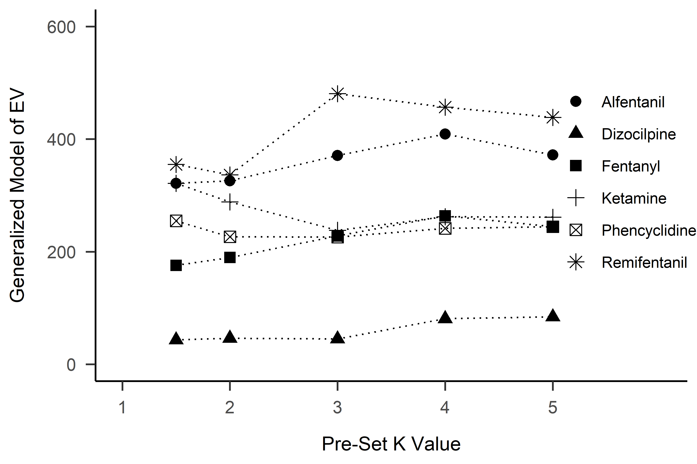

Interpretation(s) of essential value in operant demand

Shawn P. Gilroy

Louisiana State University

## Abstract

The operant demand framework has achieved high levels of adoption as an established approach for understanding how various ecological factors influence choice and consumption. A central goal of the framework proposed by Hursh and Silberburg (2008) was to isolate the "essential value" of reinforcers; namely, their effects on behavior in context. The effect of reinforcers on behavior is a phenomenon that is expected to vary as a function of dosage level (i.e., magnitude), price (i.e., schedule requirements), the intensity of demand, the availability of reinforcers (i.e., supply), and the individual's current and historical context. This technical report provides a historical summary of the concept, describes the quantitative basis of essential value in the framework of Hursh and Silberburg (2008), reviews prior attempts to approximate a generalizable index of essential value, and presents a newer formulation using exact solution to provide a more succinct and durable index. Proofs and solutions are provided to clarify the bases for novel and existing representations of EV. Recommendations are provided to improve the precision and accuracy of behavioral economics metrics as well as support consensus regarding their interpretation in the operant demand framework.

**Keywords**: operant demand, behavioral economics, essential value, elasticity

### Figure 1: Drug-level Estimates for Power Function

### Figure 2: Normalized Essential Value Estimates

### Figure 3: ***Approximated** vs. Exact Solution**s***

### Figure 4: Comparisons of Power Function to Omega Function

### Figure 5: Normalized Essential Value and Unit Elasticity

### Figure 6: Rank Ordering of Essential Value across Methods

